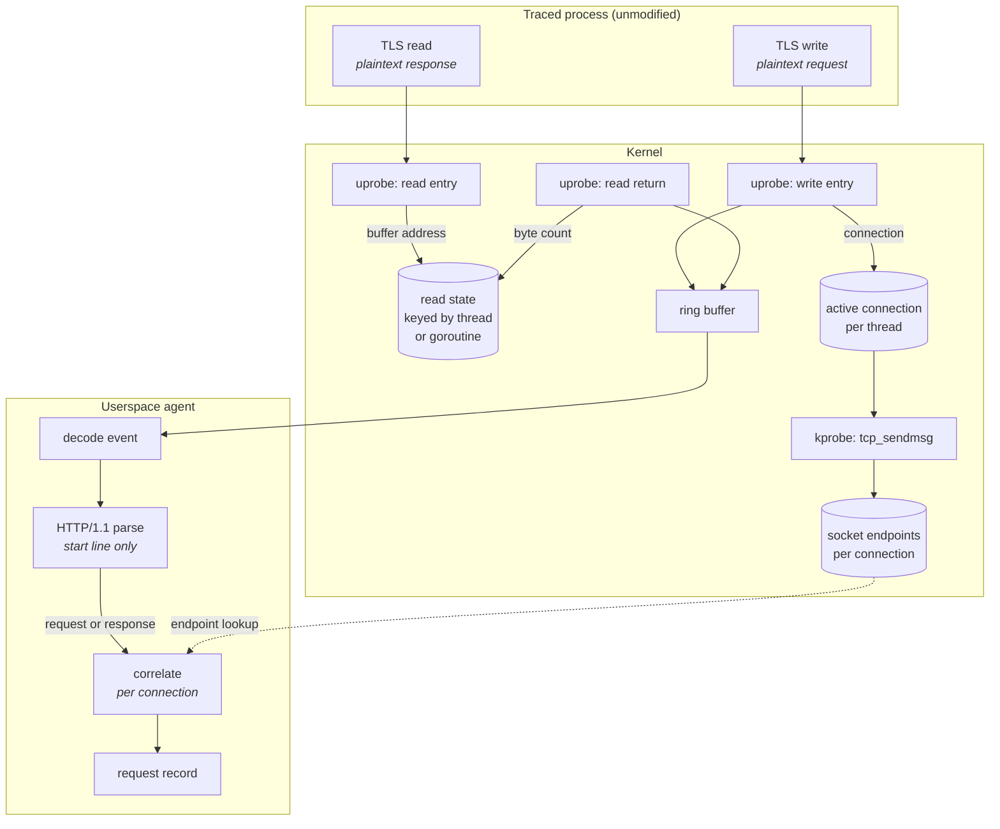

# Data path

How a request becomes a record, from the traced process to the agent's output.

The traced application is unmodified throughout. Every hook is placed either in
a shared library it loaded, in its own executable, or in the kernel — never in
its source.

---

## Overview

Solid edges carry payloads. The dotted edge is a lookup rather than a flow:
endpoints are recorded once per connection and read when a record is emitted.

---

## Step by step

### 1. Attachment

Two discovery mechanisms cover disjoint sets of processes.

A scan of `/proc` at startup finds processes already running, reading each one's
mapped libraries rather than searching the filesystem for well-known paths. A
process can load libssl from anywhere, and inside a container the path is
meaningful only in that process's mount namespace.

A tracepoint on `sched_process_exec` reports processes that start afterwards.
Polling cannot substitute for this: a process that starts and exits between two
scans is never observed, at any interval.

Attachment targets differ by TLS implementation:

| Implementation | Target | Consequence |
| :--- | :--- | :--- |
| OpenSSL, dynamically linked | the shared library file | one attachment covers every process that maps it |
| Go `crypto/tls` | the application binary | each distinct executable needs its own attachment |

Probes are attached per distinct file, identified by device and inode rather
than by path. The same library is reachable under several paths, and attaching
twice would duplicate every event.

### 2. Capture

`SSL_write` and `SSL_read` receive plaintext: encryption happens inside the
write path after the caller's buffer is handed over, and decryption completes
inside the read path before the caller's buffer is filled. Probing at these
boundaries yields cleartext without terminating TLS or altering certificates.

Four OpenSSL entry points are probed, not two. Callers are split between the
original and the `_ex` API with nothing to distinguish them from outside: curl
uses `SSL_write`/`SSL_read`, CPython uses `SSL_write_ex`/`SSL_read_ex`
exclusively. Probing one pair misses the other's callers silently.

The read paths are not symmetric with the write paths. A write call's buffer
holds the payload on entry; a read call receives an empty destination and fills
it before returning. The destination address is recorded on entry and retrieved
at return.

Go's return sites are probed directly rather than with a return probe. A return
probe replaces the return address on the stack with a kernel trampoline, and
Go's runtime walks its own stack using pclntab metadata, does not recognise that
address, and aborts the process.

The buffer belongs to another address space and is copied with a bounded read
that reports failure rather than faulting.

### 3. Connection identity

The payload is copied into a ring buffer record alongside the TLS connection
object — OpenSSL's `SSL*` or Go's `*tls.Conn`. That pointer is what pairs a
request with its response. It is never dereferenced, only compared.

Separately, the write probe records which connection the executing thread is
inside. A TLS write encrypts and then calls `write()`, reaching `tcp_sendmsg` on
the same thread, where the socket endpoints are read and stored against that
connection. This is the only way the four-tuple and the plaintext meet: they
exist at different layers and never appear together in one hook.

### 4. Transport

Records reach userspace through a ring buffer: a single shared buffer rather
than one per CPU, so ordering is preserved and memory is not multiplied by core
count.

When it fills, reservations fail and events are dropped with no effect on and no
signal to the traced application. A counter makes that visible; without it the
agent would under-report traffic while appearing healthy.

### 5. Parsing

Only the start line is parsed, plus the `Host` header for service identity.

A captured payload is a fixed-size prefix of one call and is frequently not HTTP
at all. Roughly half of all ingress events are five-byte TLS record headers,
which both OpenSSL and Go read in a call of their own. Response bodies arrive
through the same path as start lines.

Recognition is therefore strict. A request line must carry a known method, a
non-empty target, and a recognised version; response bodies contain prose
beginning with method names. The HTTP/2 connection preface satisfies every
structural rule for a request line and is rejected explicitly, because accepting
it would report HTTP/2 connections as requests to a path of `*`.

### 6. Correlation

A request is held against its connection until the matching response arrives,
and the pair becomes one record carrying method, path, status, duration, and
endpoints.

The connection is the correct key. The thread is not: a goroutine blocked on a
read resumes on a different thread, and a thread pool serves many connections.
The process is not: a server handles many connections at once.

Requests that receive no response are reported as expired rather than discarded,
and carry no status — the absence of a captured response does not mean the
request failed, and a synthetic error would fabricate failures that did not
occur.

---

## What the record contains

| Field | Source |
| :--- | :--- |
| method, path, host | request start line |
| status, reason | response start line |
| duration | difference between the two kernel timestamps |
| process, command | kernel, at capture time |
| local and remote endpoints | socket, via the connection binding |
| source | which TLS implementation produced it |

---

## Where it can fail

| Condition | Result |
| :--- | :--- |
| Ring buffer full | events dropped, counted, and reported |
| Statically linked OpenSSL with no exported symbols | process not traced |
| Go binary built without a symbol table | process not traced |
| HTTP/2 negotiated | payloads not recognised as HTTP |
| Kernel without the probed TCP symbol | records produced without endpoints |
| Response never captured | record expires, carrying no status |

Each of these is a silent reduction in coverage rather than an error, which is
why the agent counts what it discards.
